

  <h1 style="font-size: 36px;">Sistema Automatizado Alquiler de Vehículos</h1>

  <table border="2">

  <tr>
    <tr>
    <h2>INTEGRANTES</h2>
      <th>Nombre</th>
      <th>Código</th>
    </tr>
    <tr>
      <td>LOPEZ CATUNTA, Brayar Christian</td>
      <td>2021069822</td>
    </tr>
    <tr>
      <td>BRICEÑO DIAZ, Jorge Luis</td>
      <td>2017059611</td>
    </tr>
    <tr>
      <td>CUADROS GARCIA, Mirian</td>
      <td>2021071083</td>
    </tr>
    <tr>
      <td>CASTAÑEDA CENTURION, Jorge Enrique</td>
      <td>2021069822</td>
    </tr>
  </table>

# I. INTRODUCCION

El presente trabajo aborda la creación de un sistema automatizado para la gestión de alquiler de vehículos, desarrollado con PHP8 y MySQL. El sistema se basa en la arquitectura MVC (Modelo-Vista-Controlador) para estructurar el código de manera eficiente y mantener una clara separación entre la lógica de negocios, la presentación y el control de la aplicación. Este sistema busca resolver problemas comunes en la gestión de alquiler de vehículos, como errores en las reservas, duplicaciones y una experiencia de usuario deficiente.

El proyecto se centra en la creación de una plataforma en línea que permite a los usuarios registrarse y realizar reservas de vehículos de manera sencilla y segura. Los administradores pueden gestionar el inventario de vehículos, las reservas y los clientes, así como generar reportes y enviar notificaciones por correo electrónico. La aplicación está diseñada para ser intuitiva y permite una fácil personalización para adaptarse a diferentes necesidades empresariales.

El sistema proporcionará una solución centralizada para la gestión de alquiler de vehículos, mejorando la eficiencia operativa y reduciendo los errores humanos. Además, ofrecerá una mejor experiencia al usuario, facilitando el proceso de alquiler y brindando un servicio más confiable y accesible.

# II. RESUMEN

El proyecto tiene como objetivo principal desarrollar un sistema automatizado que facilite el proceso de alquiler de vehículos mediante una plataforma en línea. Este sistema permitirá a los usuarios registrarse y realizar reservas de vehículos, mientras que los administradores podrán gestionar el inventario de vehículos, las reservas y los clientes. Además, incluirá la generación de reportes y el envío de notificaciones por correo electrónico.

El sistema está diseñado para ser intuitivo y adaptable a diferentes necesidades empresariales, permitiendo una fácil personalización. La arquitectura MVC utilizada en el desarrollo del sistema garantiza una clara separación entre la lógica de negocios, la presentación y el control, facilitando así el mantenimiento y la escalabilidad del sistema.

## Abstract

The main objective of the project is to develop an automated system that facilitates the vehicle rental process through an online platform. This system will allow users to register and make vehicle reservations, while administrators can manage vehicle inventory, bookings, and customers. Additionally, it will include report generation and email notification functionalities.

The system is designed to be intuitive and adaptable to various business needs, enabling easy customization. The MVC architecture used in the system development ensures a clear separation between business logic, presentation, and control, thereby facilitating system maintenance and scalability.

# III. OBJETIVOS

## Objetivo General

Desarrollar un sistema automatizado que optimice la gestión de alquiler de vehículos, mejorando la eficiencia operativa y la experiencia del cliente.

## Objetivos Específicos

- Implementar la funcionalidad de registro y autenticación de usuarios: Garantizando la seguridad y privacidad de la información.
- Desarrollar un módulo para la gestión de inventarios de vehículos: Permitiendo agregar, modificar y eliminar vehículos.
- Facilitar el proceso de reserva y alquiler de vehículos: Asegurando que los usuarios puedan realizar estas acciones de manera sencilla y rápida.
- Proveer herramientas administrativas para la gestión eficiente de clientes y reservas: Incluyendo la posibilidad de modificar y cancelar reservas.
- Integrar un sistema de notificaciones por correo electrónico: Para enviar confirmaciones y recordatorios a los usuarios.
- Implementar la generación de reportes detallados: Para análisis y toma de decisiones estratégicas.

# IV. PLANTEAMIENTO DEL PROBLEMA

## Problema

Las empresas de alquiler de vehículos enfrentan diversos desafíos en la gestión eficiente de sus operaciones. Los sistemas manuales o no automatizados pueden llevar a errores en las reservas, duplicaciones y una experiencia de usuario insatisfactoria. Además, la falta de un sistema centralizado dificulta la gestión efectiva del inventario de vehículos, las reservas y los clientes.

Un sistema manual de gestión puede resultar en una operación ineficiente, pérdida de clientes y una mala reputación para la empresa. Por lo tanto, es necesario un sistema automatizado que permita gestionar estos procesos de manera eficiente, reduciendo los errores humanos y mejorando la satisfacción del cliente.

## Justificación

La implementación de un sistema automatizado para la gestión de alquiler de vehículos es crucial para aumentar la eficiencia operativa y reducir los errores. Un sistema centralizado proporciona una plataforma para gestionar de manera efectiva las reservas, los clientes y el inventario de vehículos, mejorando así la experiencia del usuario y la operatividad del negocio.

Un sistema automatizado permite realizar tareas de manera más rápida y precisa, reduciendo la carga de trabajo manual y permitiendo a los empleados concentrarse en tareas más estratégicas. Además, mejora la satisfacción del cliente al ofrecer un proceso de reserva sencillo y confiable, y proporciona una mejor visibilidad y control sobre las operaciones del negocio.

## Alcance

El sistema abarcará:

- Gestión de inventarios de vehículos: Permitiendo la alta, baja y modificación de vehículos en el sistema.
- Procesos de reserva y alquiler de vehículos: Los usuarios podrán realizar reservas y alquilar vehículos de manera sencilla y segura.
- Administración de clientes: Gestión de información de los clientes y sus reservas.
- Generación de reportes: Reportes detallados sobre las actividades del sistema para análisis y toma de decisiones estratégicas.
- Envío de notificaciones por correo electrónico: Confirmaciones y recordatorios automáticos para los usuarios.
- Interfaz de usuario intuitiva y personalizable: Adaptable a diferentes tipos de negocios de alquiler de vehículos.

# V. DESARROLLO DEL TRABAJO

## 1. Diagrama de Caso de Uso

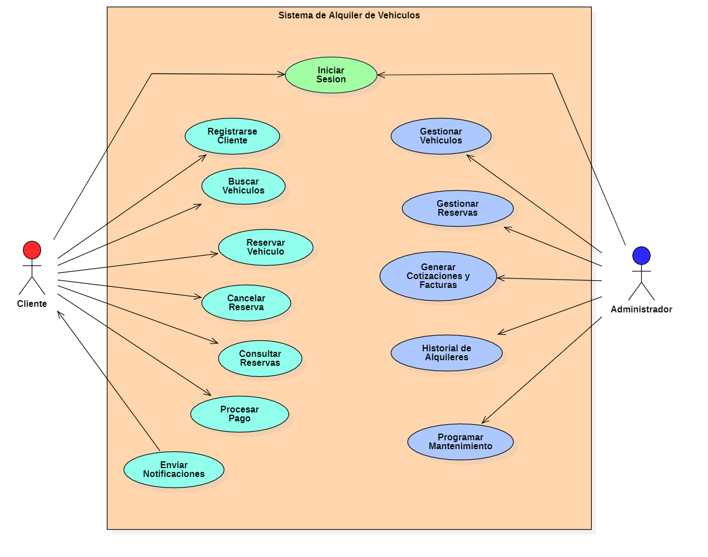

## 2. Diagrama de Paquetes

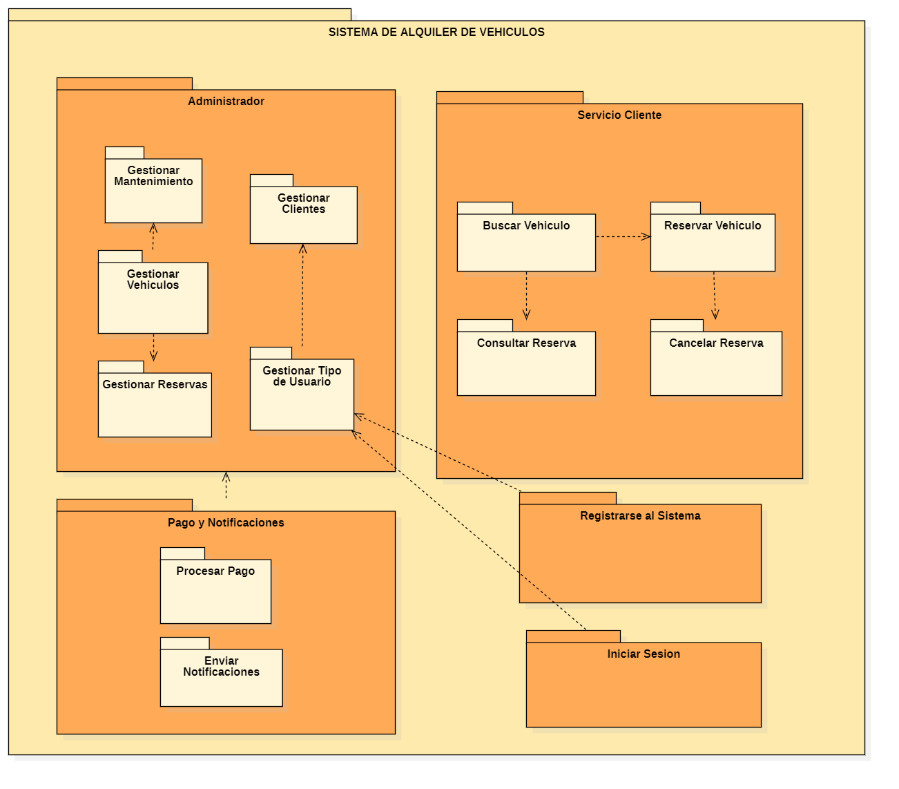

## 3. Diagrama de Clases

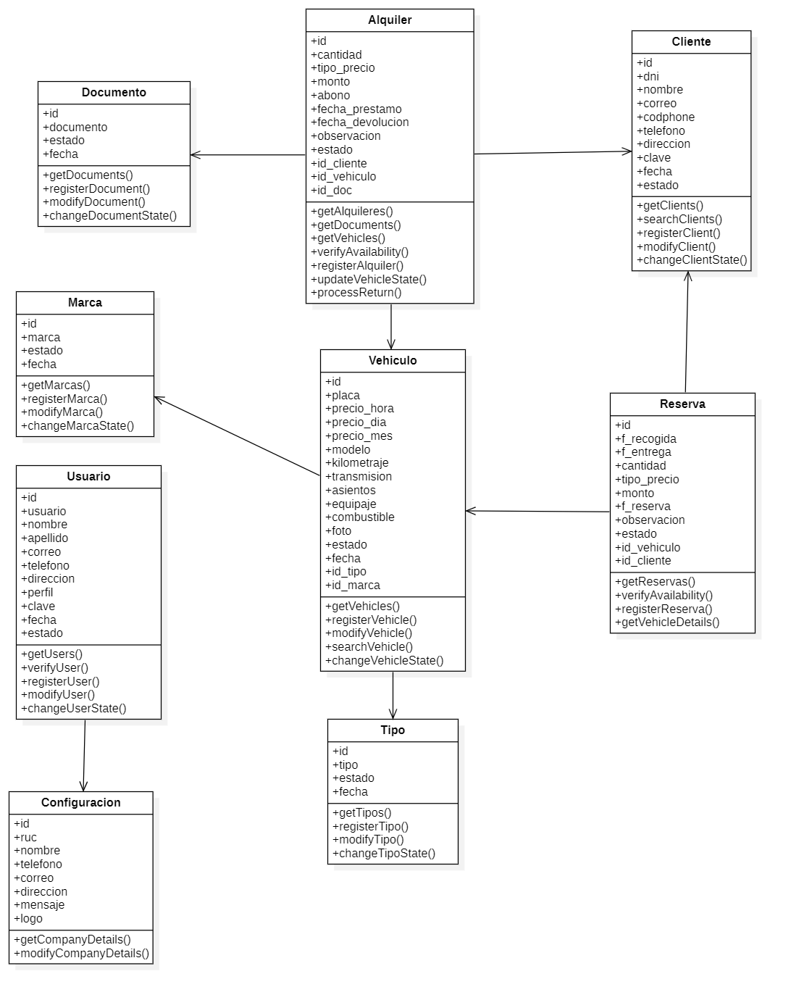

## 4. Diagrama de Componentes

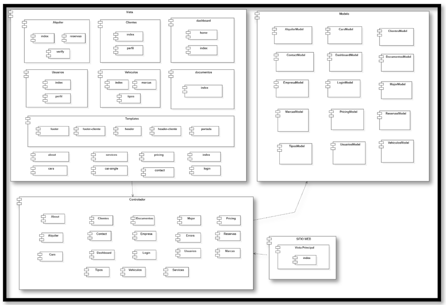

## 5. Análisis de la Aplicación con SonarQube y Snyk

### Análisis con SonarQube

SonarQube es una plataforma para la inspección continua de la calidad del código que realiza un análisis automático para identificar errores y vulnerabilidades en el código fuente. Utiliza métricas para evaluar la calidad del código y proporciona una visión detallada sobre las áreas que necesitan mejora.

### Análisis con Snyk

Snyk es una herramienta de seguridad que encuentra, reporta y soluciona vulnerabilidades en las dependencias de proyectos. Se integra con la mayoría de los lenguajes de programación y herramientas de desarrollo, ayudando a mantener el software seguro al identificar y arreglar problemas en las librerías de terceros.

## 6. Reporte de Cobertura

El reporte de cobertura mide el porcentaje de código que está siendo cubierto por pruebas automatizadas. Este reporte es esencial para asegurar que el código está adecuadamente probado y que no hay partes críticas sin pruebas. Un alto porcentaje de cobertura generalmente indica una mayor probabilidad de detectar errores antes de que el software llegue a producción.

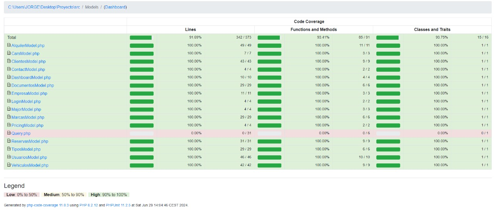

## 7. Reporte de Pruebas Guiadas por el Comportamiento (BDD Given When Then)

Las pruebas guiadas por el comportamiento (BDD) son una técnica de desarrollo ágil que fomenta la colaboración entre desarrolladores, QA y no técnicos o partes interesadas en un proyecto de software. Utiliza un lenguaje simple y estructurado para describir el comportamiento deseado de la aplicación. Un ejemplo de formato Given-When-Then es el siguiente:

- **Given**: El contexto inicial del escenario.
- **When**: El evento que ocurre.
- **Then**: El resultado esperado.

Este enfoque asegura que todos los miembros del equipo comprendan claramente cómo debe comportarse el software y permite escribir pruebas automatizadas que validen ese comportamiento.

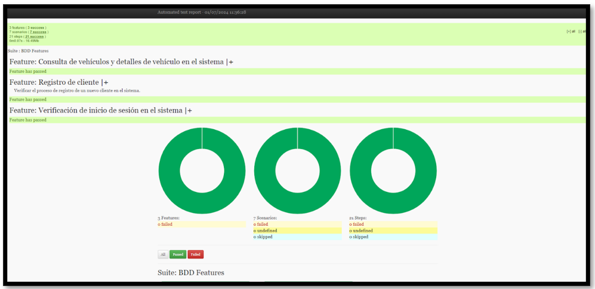

## 8. Reporte de Pruebas Guiadas por el Comportamiento (BDD Given When Then)

  

    GitHub Actions es una plataforma de integración continua y entrega continua (CI/CD) que permite automatizar flujos de trabajo de desarrollo de software directamente desde un repositorio de GitHub. Utiliza archivos YAML para definir procesos que se ejecutan en respuesta a eventos específicos como push, pull requests, issues, y más. Las características principales incluyen la capacidad de construir, probar y desplegar código, así como integrar con otros servicios y herramientas mediante el uso de acciones predefinidas o personalizadas. Esta herramienta facilita la automatización y mejora la eficiencia en el ciclo de vida del desarrollo del software.
  

  

    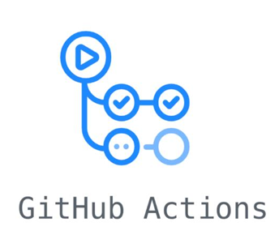
  

## 9. Configuración del proyecto dentro de la plataforma de SonarQube

Ingresamos los datos requeridos

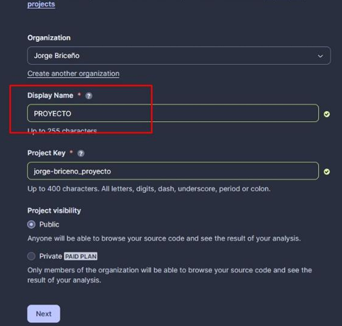

## 10. La configuración de un proyecto en SonarQube bajo la metodología

Esta configuración permite definir qué parte del código se considerará como nuevo código:Seleccionamos "Previous version", lo que significa que se considera nuevo código cualquier cambio desde la versión anterior.

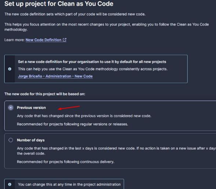

## 11. Claves Importantes Asociadas con el proyecto

Esta sección proporciona una visión general rápida de la configuración y las claves importantes asociadas con el proyecto, así como la puerta de calidad utilizada para evaluar la calidad del código. 

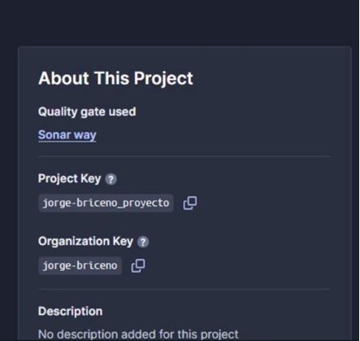

## 12. Configuracion del archivo ci.yml

El archivo YAML muestra cómo configurar un flujo de trabajo automatizado en GitHub Actions para ejecutar pruebas y realizar análisis de calidad de código con SonarQube. Esto asegura que el proyecto esté siempre bajo control de calidad continua y se mantenga en buen estado conforme se realizan cambios en el código.

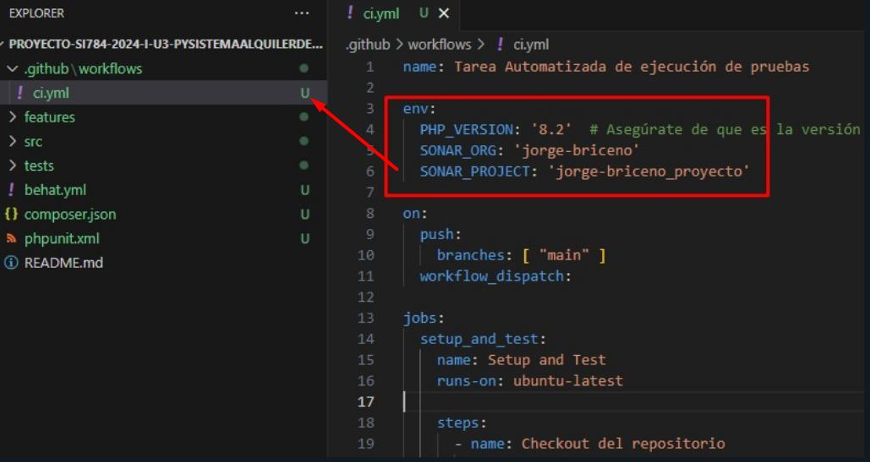

## 13. Construccion de la rama de bddreporte

Sección de configuración de GitHub Pages para un repositorio. La sección resaltada indica que el sitio de GitHub Pages se está construyendo actualmente desde la rama "bddreporte". 

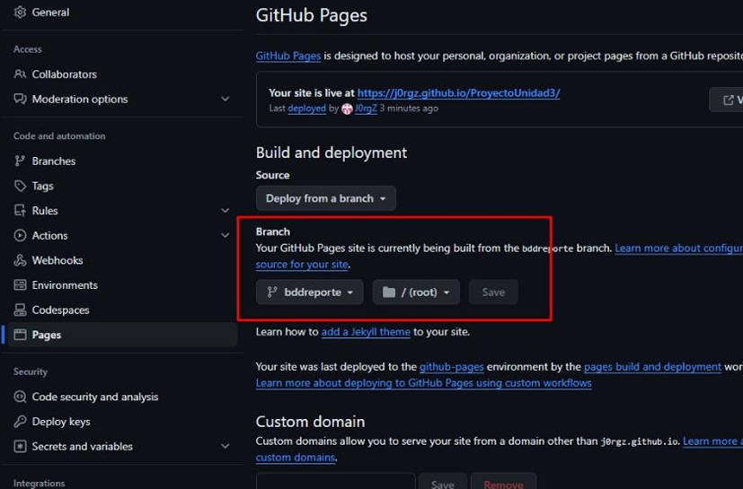

## 14. Proceso continua de ci.yml

Se ve que se están ejecutando pruebas automáticas y se configura el entorno de desarrollo para el proyecto. Además, se muestra el estado de las pruebas y la configuración del repositorio de código. 

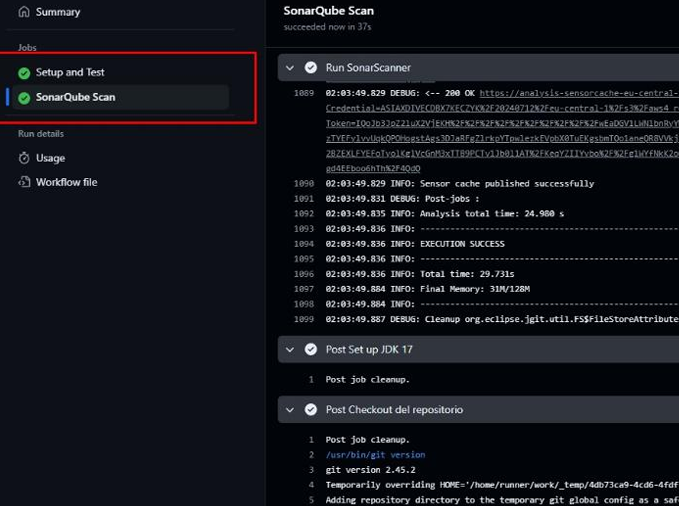

## 15. Se uso la herramienta para Automatiza el Analisis para la muestra de la Cobertura

Se usa una herramienta de análisis de código que muestra la cobertura de línea para un proyecto llamado "ProyectoUnidad3". La cobertura de línea es una medida de la cantidad de código que se ha probado. En este caso, la cobertura de línea para el código nuevo es del 92,2%. 

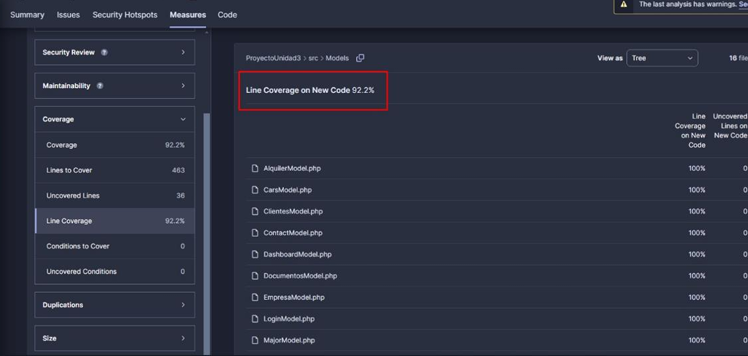

## 16. Se uso la herramienta para Automatiza el Analisis para los features

  <table style="width: 80%; border: 2px solid #4CAF50; border-collapse: collapse;">
    <thead>
      <tr style="background-color: #f2f2f2;">
        <th style="border: 2px solid #4CAF50; padding: 8px; text-align: center; color: #4CAF50;">Descripción</th>
        <th style="border: 2px solid #4CAF50; padding: 8px; text-align: center; color: #4CAF50;">Enlace</th>
      </tr>
    </thead>
    <tbody>
      <tr>
        <td style="border: 2px solid #4CAF50; padding: 8px; text-align: center;">Reporte automatizado de pruebas</td>
        <td style="border: 2px solid #4CAF50; padding: 8px; text-align: center;"><a href="https://j0rgz.github.io/ProyectoUnidad3/index.html" style="color: #4CAF50;">https://j0rgz.github.io/ProyectoUnidad3/index.html</a></td>
      </tr>
    </tbody>
  </table>

Este reporte demuestra que todas las pruebas automatizadas ejecutadas fueron exitosas, lo cual es un buen indicador de la calidad y estabilidad del sistema en su estado actual. 

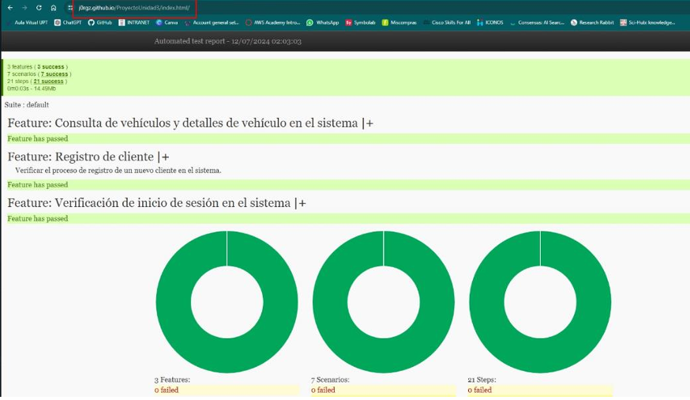

